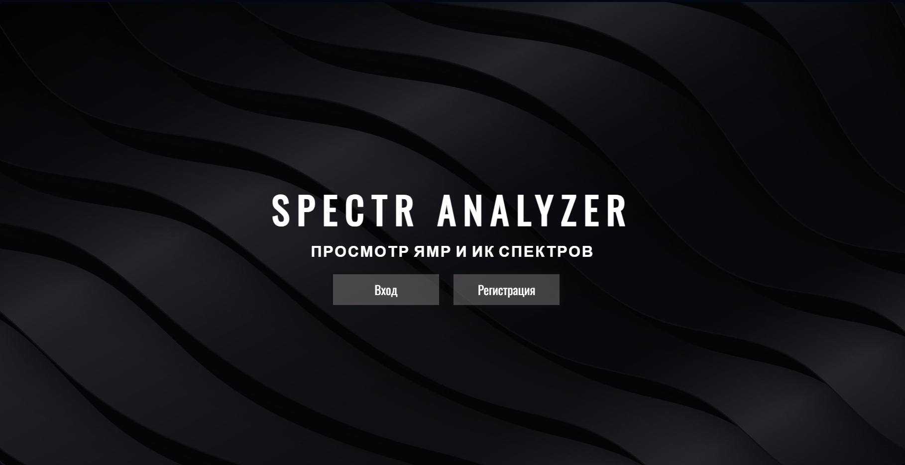
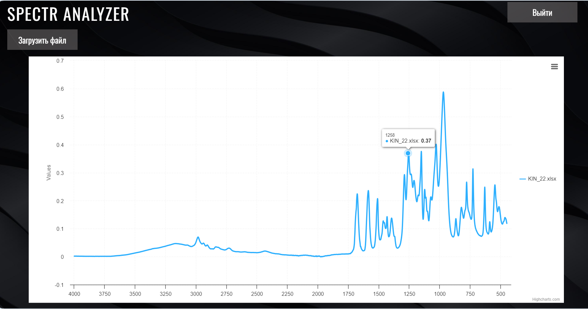

# SpectraAnalyzer

__SpectraAnalyzer__ - это веб-приложение на языке Python, предназначенное для открытия и визуализации ЯМР (Ядерного Магнитного Резонанса) и ИК (Инфракрасного) спектров в химических исследованиях.



### Mодули и библиотеки

* <a href="https://www.djangoproject.com/">Django</a>
* <a href="https://www.postgresql.org/">PostgreSQL</a>
* <a href="https://numpy.org/">NumPy</a>
* <a href="https://pandas.pydata.org/">Pandas</a>
* <a href="https://www.highcharts.com/">Highcharts</a>

## Установка

### Зависимости
Для установки SpectraAnalyzer выполните следующие шаги:

1. Прежде чем начать, убедитесь, что на вашем компьютере установлены следующие компоненты:
    * <a href="https://docs.docker.com">Docker</a>
    * <a href="https://docs.docker.com/compose/">Docker Compose</a>

### Запуск проекта
1. Клонирование репозитория: Сначала склонируйте репозиторий проекта с помощью команды git clone:
    ```bash
    git clone https://github.com/osogostok/SpectraAnalyzer
    ```
2. Перейдите в директорию, в которую был склонирован репозиторий:
    ```bash
    cd SpectraAnalyzer
    ```
3.Запустите контейнеры с помощью команды:
    ```bash
    docker-compose up -d
    ```
4. Для остановки всех контейнеров проекта выполните команду:

    ```bash
    docker-compose down
    ```

## Использование


Это веб-приложение на Django предназначено для визуализации спектров ЯМР и ИК. Пользователи могут загружать спектры в приложение, после чего они сохраняются в базе данных PostgreSQL. Для работы с приложением необходимо авторизоваться. После загрузки спектра пользователи могут просматривать его в приложении, а также выполнять различные аналитические действия, такие как масштабирование и переключение режимов просмотра. Все загруженные спектры сохраняются в базе данных, что позволяет пользователям получать доступ к ним в любое время.


