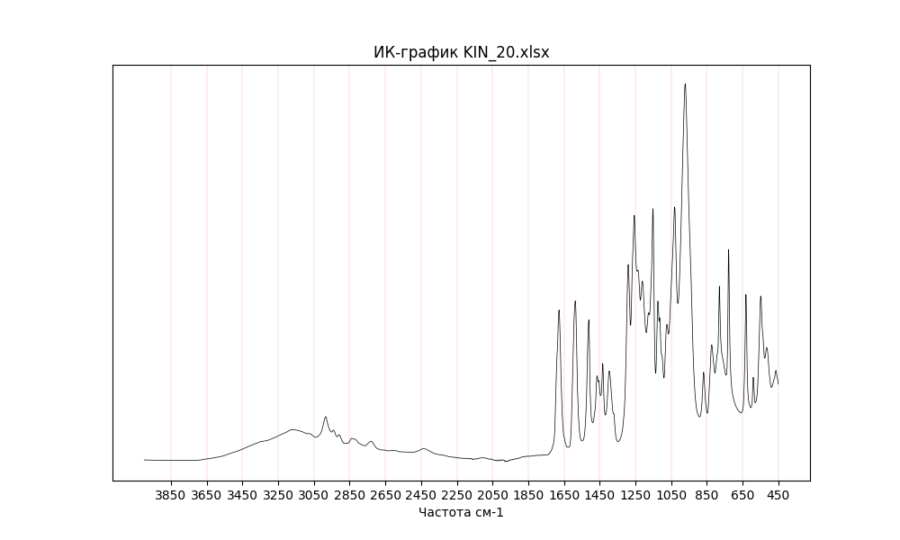

# SpectraAnalyzer

__SpectraAnalyzer__ - это консольное приложение на языке Python, предназначенное для открытия, визуализации и анализа ЯМР (Ядерного Магнитного Резонанса) и ИК (Инфракрасного) спектров в химических исследованиях.



## Установка

Для установки SpectraAnalyzer выполните следующие шаги:

1. Убедитесь, что у вас установлен Python.
2. Склонируйте репозиторий:

    ```bash
    git clone https://github.com/osogostok/SpectraAnalyzer.git
    ```

3. Перейдите в каталог __spectra_analyzer__:

    ```bash
    cd spectra_analyzer
    ```

4. Установите зависимости:

    ```bash
    pip install -r requirements.txt
    ```

## Использование

Перед началом использования приложения, убедитесь, что база данных создана и настроена в файле .env. Установите название базы данных и пароль. После запустите скрипты __sql/file.sql__ для создания таблиц и тригеров.

### Команды

- `python NMR_IR_spectr.py -n NMR_spectrum.txt` - открывает и анализирует ЯМР-спектр из файла NMR_spectrum.txt.
- `python NMR_IR_spectr.py -i IR_spectrum.xlsx` - открывает и анализирует ИК-спектр из файла IR_spectrum.xlsx.
- `python NMR_IR_spectr.py --convergence file1 file2` - проверяет сходимость ИК-спектров file1 и file2 .

Пример:

```bash
python NMR_IR_spectr.py -n NMR_spectrum.txt
python NMR_IR_spectr.py -i IR_spectrum.xlsx
python NMR_IR_spectr.py --convergence file1 file2
```

### Функциональность

- Открытие и чтение файлов ИК и ЯМР спектров.
- Визуализация спектров с использованием библиотеки Matplotlib.
- Анализ основных параметров спектров, таких как спектральная ширина и частота спектрометра.
- Проверка сходимости спектров с использованием коэффициента корреляции Пирсона и статистический тест t-критерия.

